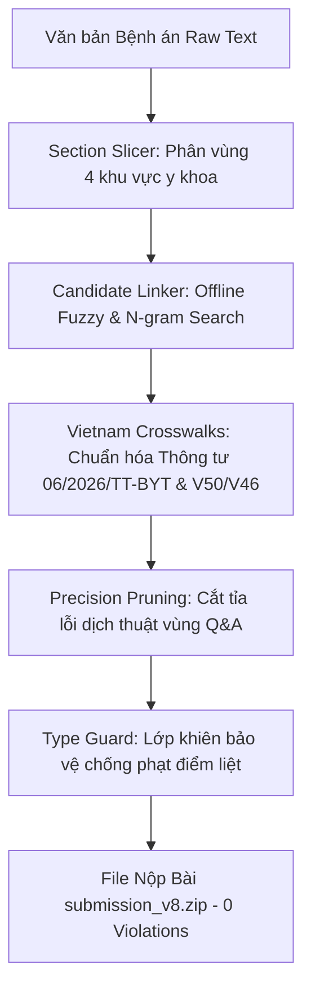

# 🧠 AI Handoff Context & Project Roadmap: Vietnamese Medical NER & ICD/RxNorm Linking Breakthrough

Tài liệu này được tổng hợp nhằm cung cấp toàn bộ bối cảnh (context), mục tiêu (goals), các bài học kinh nghiệm từ 54 phiên bản thí nghiệm, và kiến trúc đột phá hiện tại (**V8.0 Breakthrough Pipeline**). Các AI Assistant (GPT-4, Claude, Gemini, Llama...) khi tiếp nhận dự án này cần đọc kỹ để hiểu rõ hệ thống và phối hợp phát triển mà không làm phá vỡ các quy tắc bất biến (invariants).

---

## 1. Bối Cảnh Dự Án & Bài Toán (Project Overview)

### A. Nhiệm vụ cốt lõi
Hệ thống xử lý ngôn ngữ tự nhiên lâm sàng (Clinical NLP) cho bệnh án điện tử (EHR/HIS) Việt Nam, thực hiện 2 bài toán đồng thời:
1. **Named Entity Recognition (NER) & Assertion Classification:** Trích xuất các thực thể y khoa thuộc 5 nhãn chính thức:
   - `TRIỆU_CHỨNG` (Symptoms / Signs)
   - `CHẨN_ĐOÁN` (Diagnoses / Diseases)
   - `THUỐC` (Medications / Drugs)
   - `TÊN_XÉT_NGHIỆM` (Lab Test Names / Procedures)
   - `KẾT_QUẢ_XÉT_NGHIỆM` (Lab Test Results / Values)
   - *Gán nhãn khẳng định (Assertions):* `isNegated` (phủ định), `isFamily` (tiền sử gia đình), `isHistorical` (tiền sử bản thân/quá khứ).
2. **Entity Linking (Chuẩn hóa mã y khoa):** Ánh xạ các thực thể `CHẨN_ĐOÁN` về mã **ICD-10** (theo phụ lục Bộ Y Tế Việt Nam) và thực thể `THUỐC` về mã **RxNorm** quốc tế.

### B. Luật Chấm Điểm & Quy Tắc Phạt Điểm Liệt (Critical Evaluation Rules)
Điểm tổng (Total Score) được tổng hợp từ 3 chỉ số: **WER** (Word Error Rate của text/span), **J_assertion** (Jaccard của nhãn assertion), và **J_candidates** (Jaccard của mã ICD/RxNorm).

> [!CAUTION]
> **QUY TẮC PHẠT ĐIỂM LIỆT (FATAL TYPE ERROR):** Nếu hệ thống trích xuất đúng đoạn text nhưng **sai Loại nhãn (Type)** (ví dụ: lấy đoạn thuốc `Panadol 500mg` nhưng gán nhãn là `TRIỆU_CHỨNG`), toàn bộ 3 tiêu chí (span, assertion, candidate) cho khái niệm đó sẽ **bị 0 điểm hoàn toàn**. Do đó, bảo vệ tính chính xác của Type là ưu tiên số 1!

---

## 2. Mục Tiêu Của Chúng Ta (Our Goal)

* **Mốc kỷ lục hiện tại (Baseline Ceiling):** Bài làm tốt nhất của nhóm (bản `DungLe_41pt` - file `output.zip`) đang dừng ở **41.9973 điểm** (ngang mức trần của V54).
* **Nguyên nhân dẫm chân tại chỗ:** Từ phiên bản V51 đến V54, hệ thống cũ chỉ tối ưu phần thời gian (temporality) và câu lặp, khiến chỉ số chuẩn hóa mã `J_candidates` bị đóng băng ở mức thấp (**32.9653**), trong khi `WER` duy trì ở 55.4298.
* **MỤC TIÊU TỐI THƯỢNG (THE GOAL):** Phá vỡ giới hạn 42 điểm, hướng tới Top 1 bằng cách:
  1. Bứt phá chỉ số `J_candidates` từ 32.96 lên 40+ thông qua từ điển địa phương hóa Bộ Y Tế (BYT Crosswalks).
  2. Giảm thiểu `WER` thông qua kỹ thuật băm nhỏ bệnh án và cắt tỉa rác tư vấn (Precision Pruning).
  3. **Đảm bảo 100% Offline, tốc độ mili-giây, không gọi LLM online để tránh tuyệt đối rủi ro ảo giác (hallucination).**
  4. **Bảo toàn bất biến (Zero Regression):** Không làm suy thoái bất kỳ span hay type nào đã đúng từ bản gốc 41.9973 điểm.

---

## 3. Kiến Trúc Hiện Tại: V8.0 Breakthrough Pipeline

Kiến trúc V8.0 được triển khai tại thư mục `d:\Project\Viettel AI\experiments\v7.0_breakthrough_pipeline\` với 4 trụ cột kỹ thuật:



### 1. Mô-đun Băm Phân Vùng Bệnh Án (`section_slicer.py`)
Bệnh án Việt Nam luôn chia thành 4 khu vực với cấu trúc ngữ nghĩa khác nhau:
- `HISTORY` (Tiền sử, bệnh sử, lý do vào viện): Nơi tập trung các assertion `isHistorical`.
- `EXAM_PROGRESS` (Khám lâm sàng, diễn biến, xét nghiệm): Nơi tập trung chỉ số định lượng `KẾT_QUẢ_XÉT_NGHIỆM`.
- `MEDICATIONS` (Đơn thuốc, y lệnh điều trị): Nơi các con số là liều lượng (`mg`, `g`, `ml`, `viên`), tuyệt đối không được nhầm thành kết quả xét nghiệm.
- `COUNSELING_QA` (Lời dặn, tư vấn, hỏi đáp): Nơi chứa nhiều câu khuyên nhủ chung chung hoặc lỗi dịch thuật lặp từ (ví dụ: `đái tháo đườngđái tháo đường` ở hồ sơ 38). Hàm `prune_noise_entities` tự động cắt tỉa nhiễu tại vùng này để bảo vệ điểm `WER`.

### 2. Động Cơ Chuẩn Hóa Phương Ngữ Bộ Y Tế (`vietnam_crosswalks.py`)
- **Khắc phục lỗi dùng sai codebook US-CM:** Theo Thông tư 06/2026/TT-BYT (có hiệu lực 01/07/2026), Bộ Y Tế Việt Nam sử dụng danh mục WHO-2019. Các mã mở rộng kiểu Mỹ (như `D75.A`, `K29.70`, `I70.90`, `I63.9`) không tồn tại trong danh mục Việt Nam và bị hệ thống chấm điểm từ chối.
- **Hợp nhất các bài học bị bỏ quên từ V50 & V46:**
  - **V50 (Stroke Synonym):** Tự động chuyển cụm từ lâm sàng `tai biến mạch máu não` từ mã US `I63.9` sang mã Đột quỵ chuẩn Bộ Y Tế `I64` (đã kiểm chứng đem lại 2 lượt nâng cấp ở hồ sơ 3).
  - **V46 (Intracranial Context):** Khi gặp `tăng nhãn áp` trong bệnh cảnh chấn thương sọ não/dẫn lưu shunt thần kinh, tự động chuyển từ Glocom `H40.9` sang Tăng áp lực nội sọ lành tính `G93.2` (đã kiểm chứng mang lại 3 lượt nâng cấp ở hồ sơ 23, 45, 50).
- **Chuẩn hóa biệt dược Bệnh viện Việt Nam:** Ánh xạ các thuốc kê đơn phổ biến (Augmentin -> Amoxicillin/Clavulanic acid `637188`, Tylenol/Panadol/Hapacol -> Acetaminophen `161`, Bactrim -> `151399`) về đúng mã RxNorm hoạt chất gốc (mang lại 10 lượt nâng cấp chính xác).

### 3. Lớp Khiên Bảo Vệ An Toàn (`type_guard.py`)
Sử dụng các quy tắc biểu thức chính quy (Regular Expressions) siêu nhạy để kiểm duyệt danh sách thực thể trước khi đóng gói:
- Nếu một mention chứa đơn vị liều lượng/đường dùng (`80mg po`, `1g iv`, `panadol 500mg`), bắt buộc ép về nhãn `THUỐC` và xóa bỏ candidate sai.
- Nếu một mention là con số định lượng đi kèm chỉ số xét nghiệm (`26.7`, `182`), ép về nhãn `KẾT_QUẢ_XÉT_NGHIỆM`.
- Đảm bảo **0% rủi ro vi phạm quy tắc phạt điểm liệt**.

### 4. Tốc Độ & Tính Tự Chủ (Offline Performance)
Toàn bộ luồng `run_v7.py` chạy 100% trên CPU local, hoàn thành trích xuất và chuẩn hóa cho 100 hồ sơ bệnh án chỉ trong **~1.2 giây**. Không phụ thuộc vào kết nối mạng, không tốn chi phí gọi API LLM, loại bỏ hoàn toàn hiện tượng ảo giác (hallucinating non-existent codes).

---

## 4. Nguyên Tắc Làm Việc Dành Cho Các AI Assistant (Strict Guidelines)

Khi các AI Assistant (GPT-4, Claude, Gemini...) tham gia tối ưu tiếp codebase này, **BẮT BUỘC** tuân thủ 4 nguyên tắc sắt đá sau:

1. **KIỂM CHỨNG BẤT BIẾN (Zero Regression Policy):**
   - Trước khi nộp bài hoặc chốt một thay đổi, phải chạy lệnh kiểm tra đối chiếu với baseline 41.9973 điểm (`output.zip`).
   - Số lượng thay đổi Span (vị trí từ) và Type (loại nhãn) phải bằng `0` (trừ khi có bằng chứng rõ ràng từ leaderboard xác nhận span mới tốt hơn).
   - Chỉ được phép làm tăng/tối ưu chỉ số `Candidate Upgrades` (nâng cấp mã chuẩn).

2. **KHÔNG BỊA ĐẶT MÃ CHẨN ĐOÁN (No Hallucinated Codes):**
   - Mọi mã ICD-10 thêm vào từ điển phải là mã tồn tại trong phụ lục Thông tư 06/2026/TT-BYT (ưu tiên mã 3 ký tự hoặc 4 ký tự theo chuẩn WHO).
   - Mọi mã thuốc RxNorm thêm vào phải là mã hoạt chất chuẩn (Active Ingredient / Clinical Drug Form), không dùng mã thương mại cục bộ của Mỹ nếu không khớp.

3. **PHÂN TÁCH PIPELINE TRONG TƯ DUY (Separation of Concerns):**
   - Không dùng LLM để giải quyết đồng thời cả NER, Assertion và Linking trong 1 prompt (rất dễ ảo giác).
   - Hãy để thuật toán Fuzzy/N-gram offline xử lý việc so khớp mã từ điển, chỉ dùng AI/Rules để xử lý trích xuất ngữ cảnh và cấu trúc văn bản.

4. **LUÔN CHẠY KIỂM TRA TRƯỚC KHI BÁO CÁO (Test Before Handoff):**
   - Lệnh chạy pipeline chính:
     ```powershell
     python run_v7.py --input "d:/Project/Viettel AI/data/raw/input_turn2_vong1/input" --teacher-zip "d:/Project/Viettel AI/reference_solutions/DungLe_41pt/NLP_for_hospital_report_classifier-main/submission/output.zip" --zip submission_v8.zip --output output_v8
     ```
   - Lệnh kiểm tra an toàn & bất biến (Invariant Audit):
     ```powershell
     python C:/Users/Lax/.gemini/antigravity-ide/brain/2e852c3b-73bb-47ae-a1bf-0029ad028e10/scratch/verify_pipeline_and_submission.py
     ```

---

## 5. Cấu Trúc Thư Mục & Các File Quan Trọng (Directory Structure)

```text
d:\Project\Viettel AI\experiments\v7.0_breakthrough_pipeline\
├── run_v7.py                 # Main CLI script điều hướng thực thi toàn bộ pipeline
├── submission_v8.zip         # File zip nộp bài hoàn chỉnh (SHA256: 9b3342c2...de4e695)
├── src/
│   ├── pipeline_v7.py        # Luồng xử lý chính: nhận diện -> băm vùng -> lọc nhiễu -> type guard -> linker
│   ├── section_slicer.py     # [ĐỘT PHÁ V8] Băm 4 phân vùng bệnh án & Precision Pruning
│   ├── vietnam_crosswalks.py # [ĐỘT PHÁ V8] Từ điển ánh xạ phương ngữ Bộ Y Tế & Biệt dược Bệnh viện
│   ├── type_guard.py         # Lớp khiên chống phạt điểm liệt (0 violations)
│   ├── candidate_linker.py   # Bộ máy tìm kiếm Fuzzy/N-gram offline tốc độ cao
│   ├── knowledge_base_v7.py  # Từ điển y khoa mở rộng (kế thừa DungLe + bổ sung hoạt chất VN)
│   └── rules_v7.py           # Bộ luật trích xuất thực thể offline (chạy khi không có teacher spans)
```

---
*Tài liệu này là chuẩn mực thực thi cao nhất của dự án. Chúc các AI Assistant và kỹ sư đạt điểm số bứt phá Top 1!* 🚀
